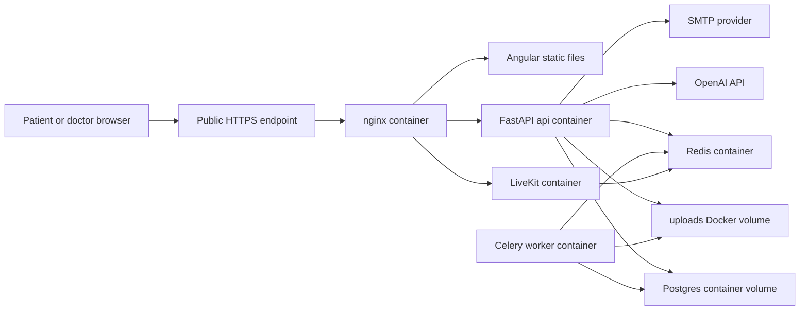

# Architecture Document

Date: 2026-05-19  
System: NephroAI medical SaaS for Ecuador  
Audience: security review, SOC 2 readiness, engineering onboarding

## Purpose

NephroAI lets patients upload laboratory PDFs, extracts structured lab values, visualizes trends, and allows doctors to access patient data only after an explicit patient grant. UI and AI-facing responses must be in Spanish.

## Production Components

| Component | Technology | Responsibility |
| --- | --- | --- |
| Web frontend | Angular 20 standalone components | Patient and doctor UI at `https://app.nephroai.ec`. |
| Landing page | Static files served by nginx | Public marketing site at `https://nephroai.ec`. |
| API | Python 3.11, FastAPI, gunicorn/uvicorn | Auth, uploads, lab data, charts, doctor access, consultations, AI endpoints. |
| Worker | Celery | Background PDF processing. |
| Database | PostgreSQL 15 in Docker | Users, patients, lab results, documents, grants, consultations, messages, payments. |
| Cache/broker | Redis | Celery broker/result backend and LiveKit support. |
| Video calls | LiveKit | Doctor-patient consultation calls. |
| Reverse proxy | nginx | Static frontend, API proxy, LiveKit proxy. |
| LLM provider | OpenAI Responses API | V2 extraction and AI assistant workflows. |
| Email provider | SMTP/Resend | Email verification and password reset messages. |
| CI/CD | GitHub Actions, SCP, SSH, Docker Compose | Test, build, deploy to production server. |

## Deployment Topology

Note: repository nginx config listens on port 80 inside Docker. Public TLS termination and HTTPS redirect must be verified and documented separately if handled by an external proxy, CDN, host-level nginx, or certificate automation.

## Main Data Flows

### Registration and Authentication

1. User registers with email/password.
2. Backend hashes password using `pbkdf2_sha256`.
3. Backend creates email verification code, stores only a salted SHA-256 hash of the code, sends code by SMTP.
4. After verification, backend issues JWT access token.
5. Frontend uses `accessToken` from `POST /api/auth/login`.

Security controls:

- Production requires `JWT_SECRET` or `SECRET_KEY`.
- Verification/reset codes have TTL, cooldown, max attempts, and per-hour send limit.
- Password reset uses short-lived JWT with `purpose=password_reset`.

### PDF Upload and Lab Extraction

1. Authenticated patient uploads a PDF.
2. Backend stores upload metadata and file content.
3. V2 pipeline extracts lab values, using OpenAI structured outputs where configured.
4. Structured lab results are stored in Postgres and rendered in charts.
5. Duplicate V2 documents are constrained by `(user_id, document_hash)`.

Security controls:

- Uploads are linked to authenticated user/patient records.
- V2 document ownership is stored in the database.
- Gaps: upload encryption at rest, retention, malware scanning, and audit logging need formal implementation/evidence.

### Doctor Access

1. Patient grants access to a doctor by email.
2. Backend stores `DoctorGrant` with `patient_id`, `doctor_email`, optional `doctor_id`, `can_message`, `can_call`, and `revoked_at`.
3. Doctor routes call `_ensure_doctor_access()` or consultation participant checks.
4. Patient can revoke grants and update consultation permissions.

Security controls:

- Doctor must have an active grant to access patient lab data.
- Calls can only be started by doctors and only if `can_call` is enabled.
- Gaps: audit logging and periodic access review.

### AI Assistant

1. Backend builds a compact clinical/lab context for the authenticated user or granted patient.
2. Backend calls OpenAI.
3. User-facing AI output must be in Spanish.

Security controls:

- API key is loaded from environment.
- Gaps: vendor risk documentation, data minimization policy, retention settings, and explicit disclosure/consent.

## Data Classification

| Data | Examples | Classification | Storage |
| --- | --- | --- | --- |
| Account data | Email, full name, password hash | Confidential | Postgres |
| Medical data | Lab values, documents, patient records | Restricted medical data | Postgres, uploads volume |
| Consultation data | Messages, call metadata, notes | Restricted medical data | Postgres, LiveKit transient media |
| AI processing data | Extracted lab context, prompts, PDFs | Restricted medical data | Sent to OpenAI during processing |
| Operational data | Logs, health checks, deploy metadata | Internal | GitHub Actions, Docker logs |

## Trust Boundaries

- Internet to public HTTPS endpoint.
- Public reverse proxy to private Docker network.
- API/worker to Postgres, Redis, uploads.
- API to external vendors: OpenAI, SMTP, GitHub Actions, LiveKit depending on deployment.
- SSH deployment from GitHub Actions to production server.

## Key Architecture Gaps

- TLS termination is not proven from repository config alone.
- Database, upload, and backup encryption at rest need evidence.
- No dedicated audit log table was found.
- Observability is limited to logs and health checks.
- Production database credentials in compose have unsafe defaults.
- No formal backup/restore process is documented.
